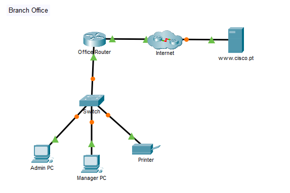
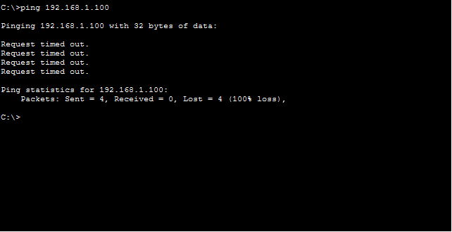
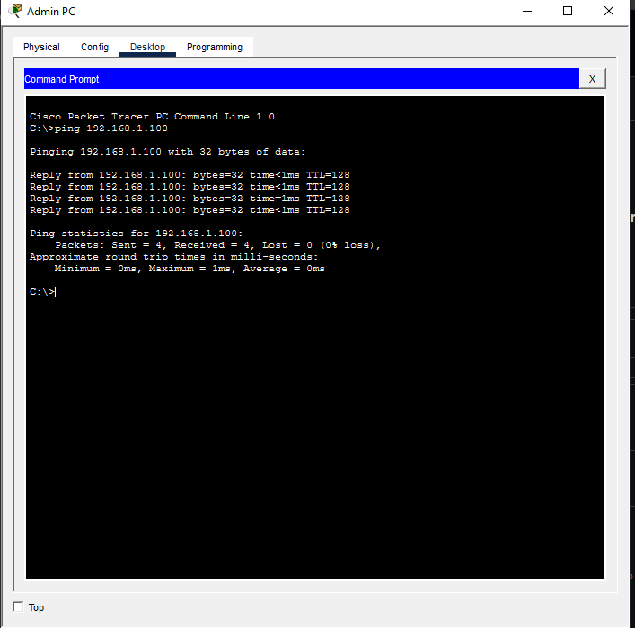
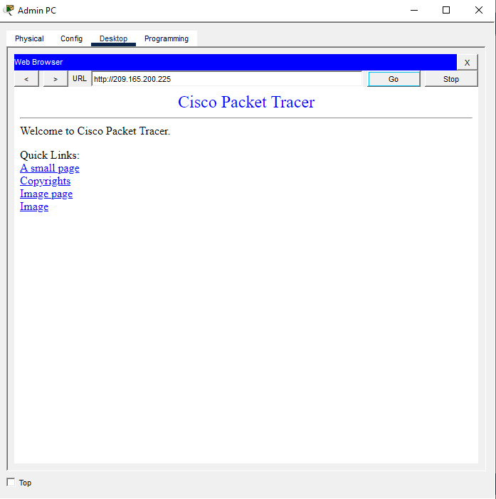
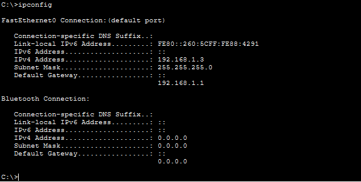
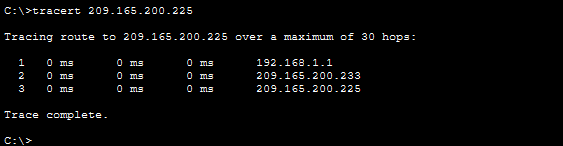

# Configuração de LAN Básica no Cisco Packet Tracer

## 📋 Descrição

Documentação prática de uma atividade de **configuração de rede local (LAN)** no Cisco Packet Tracer. Este projeto demonstra como montar uma topologia de rede, configurar endereços IP, testar conectividade e diagnosticar problemas de rede usando comandos essenciais.

**Ideal para:** Iniciantes em redes que querem aprender na prática como funcionam LANs, DHCP, IP estático e ferramentas de diagnóstico.

---

## 🎯 Objetivos Alcançados

- ✅ Montar uma topologia de rede com múltiplos dispositivos
- ✅ Configurar IPs via DHCP e IP estático
- ✅ Testar conectividade entre dispositivos
- ✅ Acessar servidores web via navegador
- ✅ Usar comandos de diagnóstico (ping, ipconfig, tracert)
- ✅ Identificar e corrigir erros de configuração

---

## 🏗️ Topologia da Rede

                [Internet - ISP1]
                       |
                [Office Router]
                       |
                    [Switch]
                /      |      \
          [Admin PC] [Manager PC] [Printer]
          192.168.1.2  192.168.1.3  192.168.1.100
          (DHCP)       (DHCP)       (Estático)

          
### Componentes

| Dispositivo | Tipo | IP | Configuração |
|---|---|---|---|
| Office Router | Roteador | 192.168.1.1 | Gateway padrão |
| Switch | Switch L2 | - | Distribuidor de conexões |
| Admin PC | PC | 192.168.1.2 | DHCP |
| Manager PC | PC | 192.168.1.3 | DHCP |
| Printer | Impressora | 192.168.1.100 | IP Estático |
| Internet | WAN | - | ISP1 |

---

## 📚 Documentação Detalhada

### 1. [Topologia da Rede](./TOPOLOGIA.md)
- Descrição de cada dispositivo
- Conexões entre componentes
- Configuração do roteador

### 2. [Configuração de IPs](./CONFIGURACAO-IPS.md)
- Como configurar DHCP nos PCs
- Como configurar IP estático na impressora
- Passo a passo com screenshots

### 3. [Testes de Conectividade](./TESTES-CONECTIVIDADE.md)
- Teste de ping (Admin PC → Printer)
- Acesso ao navegador web
- Verificação de conectividade

### 4. [Comandos de Rede](./COMANDOS-REDE.md)
- `ipconfig` - Visualizar configuração de IP
- `ping` - Testar conectividade
- `tracert` - Rastrear caminho até servidor

### 5. [Diagramas Visuais](./DIAGRAMAS.md)
- Diagramas ASCII da topologia
- Resultados dos testes

### 6. [Aprendizados](./APRENDIZADOS.md)
- Conceitos aprendidos
- Dicas e boas práticas
- Próximos passos

---

## 🚀 Como Usar Este Repositório

1. **Leia o README** (você está aqui!)
2. **Estude a topologia** em `TOPOLOGIA.md`
3. **Siga o passo a passo** em `CONFIGURACAO-IPS.md`
4. **Execute os testes** em `TESTES-CONECTIVIDADE.md`
5. **Aprenda os comandos** em `COMANDOS-REDE.md`
6. **Veja os diagramas** em `DIAGRAMAS.md`
7. **Revise os aprendizados** em `APRENDIZADOS.md`

---

## 📸 Screenshots

### Topologia Completa

### Ping - Falha

### Ping - Sucesso

### Navegador Web

### ipconfig

### tracert

---

## 🔧 Requisitos

- **Cisco Packet Tracer** (versão 8.0 ou superior)
- Conhecimento básico de redes (opcional)
- Disposição para aprender!

---

## 📖 Conceitos-Chave

### DHCP (Dynamic Host Configuration Protocol)
- Protocolo que **distribui IPs automaticamente**
- Ideal para PCs que se conectam e desconectam frequentemente
- Usado nos PCs (Admin PC e Manager PC)

### IP Estático
- Endereço IP **fixo e permanente**
- Ideal para servidores e impressoras
- Usado na Printer (192.168.1.100)

### Gateway Padrão
- Roteador que conecta a rede local à internet
- Todos os dispositivos precisam conhecer o gateway
- Neste caso: 192.168.1.1

### Ping
- Ferramenta para **testar conectividade**
- Envia pacotes ICMP e aguarda resposta
- Resultado: "Reply from" = conectado ✅

### Tracert
- Mostra o **caminho** que os pacotes fazem até o destino
- Exibe cada "hop" (salto) na rota
- Útil para diagnosticar problemas de roteamento

---

## ✅ Checklist de Conclusão

- [x] Topologia montada
- [x] Cabos conectados
- [x] IPs configurados (DHCP e estático)
- [x] Ping para impressora: 0% loss
- [x] Navegador web funcionando
- [x] Comando ipconfig executado
- [x] Comando tracert executado
- [x] Documentação completa

---

## 🎓 Próximos Passos

Depois de dominar este lab, você pode:

1. **Adicionar VLAN** - Segmentar a rede
2. **Configurar ACL** - Controlar tráfego
3. **Implementar NAT** - Tradução de endereços
4. **Adicionar Firewall** - Segurança de rede
5. **Configurar Roteamento Dinâmico** - OSPF, RIP, BGP

---

## 📝 Notas Importantes

### Erro Encontrado e Corrigido
- **Problema:** Ping inicial falhou (100% loss)
- **Causa:** IP da impressora estava errado (192.169.1.100 em vez de 192.168.1.100)
- **Solução:** Corrigir o IP para 192.168.1.100
- **Resultado:** Ping passou a funcionar (0% loss)

### Dicas de Troubleshooting
1. Sempre verifique se os cabos estão conectados (triângulos verdes)
2. Confirme que os IPs estão na mesma sub-rede
3. Use `ping` para testar conectividade básica
4. Use `tracert` para diagnosticar problemas de roteamento
5. Verifique o gateway padrão com `ipconfig`

---

## 👨‍💻 Autor

**Samuel Caldeira**  
Estudante de Cibersegurança  

---

## 📄 Licença

Este projeto está sob a licença **MIT**. Sinta-se livre para usar, modificar e compartilhar!

---

## 🤝 Contribuições

Sugestões e melhorias são bem-vindas! Abra uma **issue** ou **pull request**.

---

**Última atualização:** 12 de junho de 2026  
**Status:** ✅ Projeto Completo
